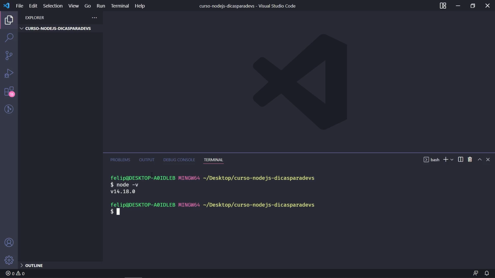
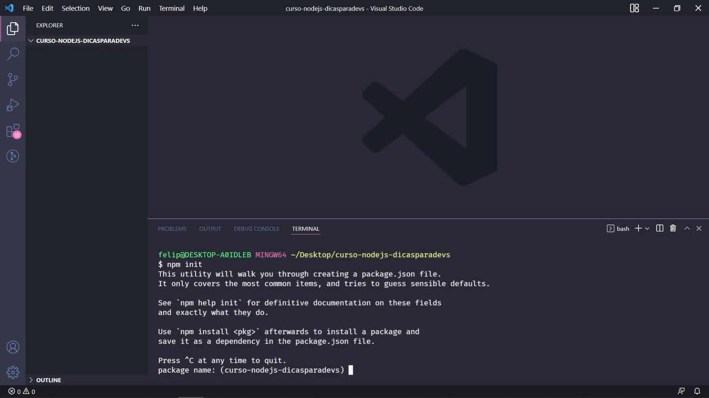
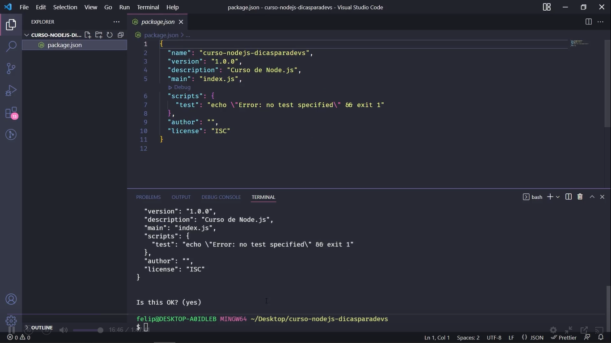
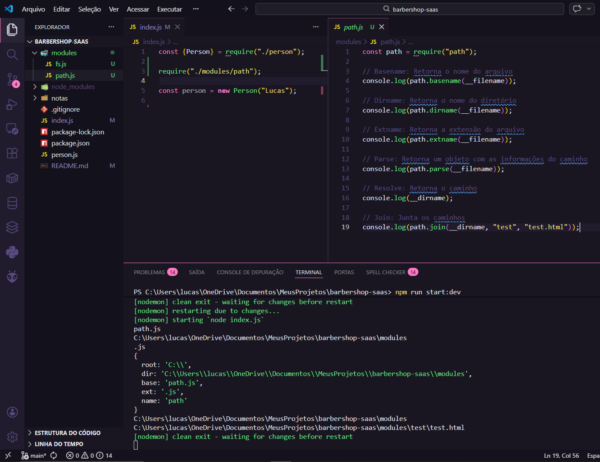

# Aula 01: Setup Inicial do Projeto Node.js - Criação, importe, instalação de Modulos

Nesta etapa inicial, realizei a configuração do ambiente de desenvolvimento, preparei a estrutura base do projeto e configurei as ferramentas de produtividade.

## 🛠️ Passo a Passo Executado

### 1. Preparação do Ambiente
O primeiro passo foi garantir que o ambiente de execução estava pronto.
- **Instalação do Node.js:** Download e instalação da versão LTS.

- **Verificação:** Verificar se o node está instalado na maquina.
    ```bash
    node -v
    ```
    

### 2. Inicialização do Projeto
Criação do arquivo `package.json`, que gerencia as dependências do nosso SaaS.

```bash
npm init
```



### 3. Estrutura de Arquivos Inicial
Criei os primeiros arquivos de lógica para testar o entendimento de módulos e objetos:
- `person.js`: Responsável pela definição da entidade ou lógica de pessoa/usuário.

- `index.js:` Ponto de entrada (entry point) da aplicação.


### 4. Instalação do Nodemon
Para ganhar agilidade no desenvolvimento (reinicialização automática do servidor ao salvar arquivos), instalei o Nodemon como dependência de desenvolvimento:
```bash
npm install nodemon --save-dev
```


### 5. Configuração do Git e Script de Execução
- **.gitignore:** Criei o arquivo para evitar que a pasta node_modules seja enviada para o GitHub (mantendo o repositório leve).

- **Scripts:** Adicionei o script de inicialização no package.json para facilitar o comando de execução:
    ```JSON
    "scripts": {
        "dev": "nodemon index.js"
    }
    ```
    

## 6. Módulos Nativos Explorados
### 💼 Módulo Path
Utilizado para manipular caminhos de arquivos e diretórios de forma segura entre diferentes sistemas operacionais.
- Principais métodos: `basename`, `dirname`, `extname`, `parse` e `join`.


### 📁 Módulo File System (fs)
Utilizado para interagir com o sistema de arquivos do computador (I/O).
- **Operações realizadas**: 
    - Criação de pastas: `mkdir`;
        
    - Escrita de arquivos: `writeFile`; 
        
    - Atualização: `appendFile` e Leitura: `readFile`.
        

## 💡 Notas de Aprendizado
- O `npm init` agiliza o processo criando o arquivo de configuração com valores padrão.
- O uso do `.gitignore` é uma boa prática fundamental de segurança e organização em projetos profissionais.
- Separar a lógica em `person.js` e importar no `index.js` já começa a introduzir conceitos de modularização.
- O módulo `fs` permite que nossa aplicação salve dados de forma persistente mesmo sem um banco de dados complexo inicialmente.

## 🚀 Como rodar o projeto desta aula
```bash
npm run start:dev
```