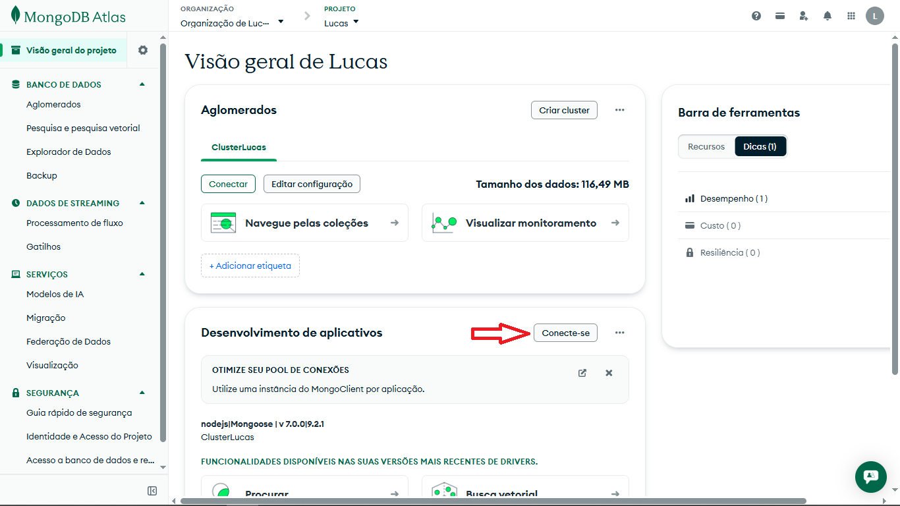
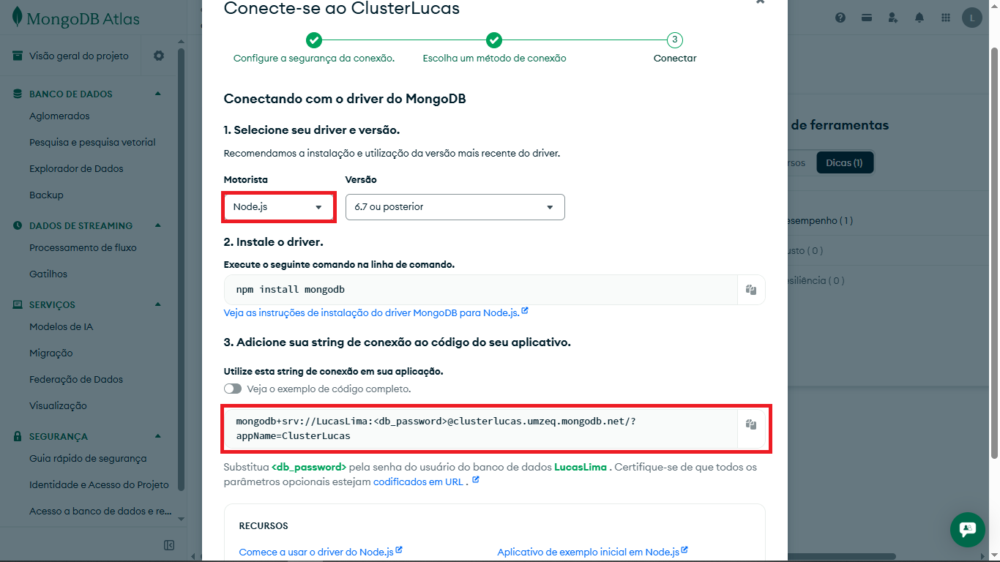
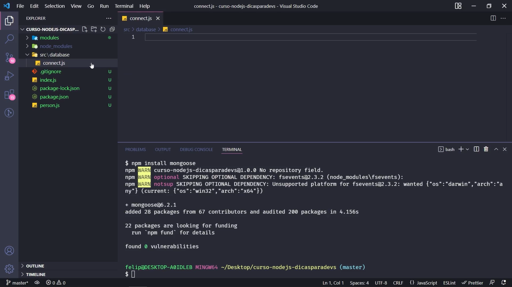
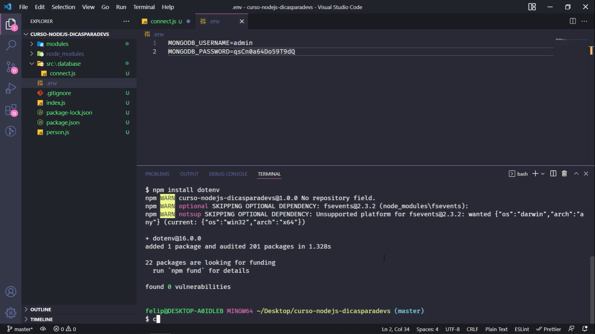

# Aula 03: 💾 Conexão com Banco de Dados - MongoDB

Nesta etapa, integrei o banco de dados NoSQL **MongoDB Atlas** ao SaaS da Barbearia, garantindo que as informações do sistema sejam armazenadas de forma persistente e segura.

## 🛠️ Tecnologias e Ferramentas
- **MongoDB Atlas:** Cluster na nuvem para hospedagem do banco de dados.
- **Mongoose:** Biblioteca ODM (Object Data Modeling) para Node.js que facilita a conexão e modelagem de dados.
- **Dotenv:** Ferramenta para gerenciamento de variáveis de ambiente.

## 🔑 Segurança com Variáveis de Ambiente (.env)
Para proteger as credenciais de acesso ao banco de dados (usuário e senha), utilizei o conceito de **variáveis de ambiente**:

1.  **Arquivo `.env`:** Criei um arquivo na raiz do projeto para armazenar dados sensíveis. Este arquivo **nunca** é enviado ao GitHub.
2.  **Biblioteca dotenv:** Utilizada para carregar essas variáveis para dentro do `process.env` do Node.js.
3.  **Configuração no Código:**
    ```javascript
    require('dotenv').config();
    const username = process.env.MONGODB_USERNAME;
    const password = process.env.MONGODB_PASSWORD;
    ```

## 🏗️ Implementação da Conexão

Para integrar o banco de dados ao SaaS, segui um fluxo de trabalho que garante segurança e organização do código.

### 1. Obtendo a String de Conexão (MongoDB Atlas)
O primeiro passo foi configurar o cluster na nuvem:

- Acesse o painel do **MongoDB Atlas**.
- Clique em **Connect** no seu Cluster (ClusterLucas).
    
- Escolha a opção **"Drivers"** e copie a URL de conexão.
    
- **Importante:** Substitua `<password>` na string pela senha do seu usuário de banco de dados (configurado em Database Access).

### 2. Instalando as Dependências
No terminal, instalei as bibliotecas necessárias para a comunicação com o banco e gerenciamento de variáveis de ambiente:

```Bash
npm install mongoose dotenv
```


### 3. Configurando a Segurança com Dotenv
Criei um arquivo `.env` na raiz do projeto para armazenar dados sensíveis, evitando que senhas sejam expostas no GitHub.
- Variáveis: `MONGODB_USERNAME` e `MONGODB_PASSWORD`.
- Gitignore: Verifiquei se o arquivo `.env` está listado no `.gitignore`.



### 4. Criando o Arquivo de Conexão (`connect.js`)
Criei o arquivo `src/database/connect.js` para isolar a lógica do banco de dados.
Neste arquivo, utilizei a nova convenção de **Promises (Async/Await)** exigida pelas versões atuais do Mongoose:

```JavaScript
const mongoose = require("mongoose");

const connectToDatabase = async () => {
    try {
        await mongoose.connect(
        // A string utiliza Template Strings para injetar as variáveis do .env
    );
    console.log("Conexão com o banco de dados realizada com sucesso!");
    } catch (error) {
        console.log("Erro ao conectar com o banco de dados: ", error);
    }
};
module.exports = connectToDatabase;
```

### 5. 🔗 Inicializando a Conexão no `index.js`
Por fim, no ponto de entrada da aplicação (`index.js`), chamei a configuração do `dotenv` e a função de conexão:
```JavaScript
require("dotenv").config(); // Carrega as variáveis de ambiente primeiro
const connectToDatabase = require("./src/database/connect");

connectToDatabase();
```
## 💡 Notas de Aprendizado
- **Segurança:** O uso do `.env` combinado com o `.gitignore` é uma prática obrigatória para evitar o vazamento de segredos em repositórios públicos.
- **Resiliência:** O tratamento de erros na conexão impede que a aplicação trave sem aviso, fornecendo logs claros do que aconteceu (ex: falha de autenticação ou erro de rede).
- **Escalabilidade:** Com o MongoDB Atlas, o SaaS está preparado para crescer conforme o número de agendamentos e clientes da barbearia aumentarem.

## 🚀 Como validar a conexão
Ao rodar npm run start:dev, o terminal deve exibir a mensagem confirmando a injeção das variáveis e o sucesso da conexão com o Cluster.
```bash
[dotenv] injecting env (2) from .env
Conexão com o banco de dados realizada com sucesso!
```
