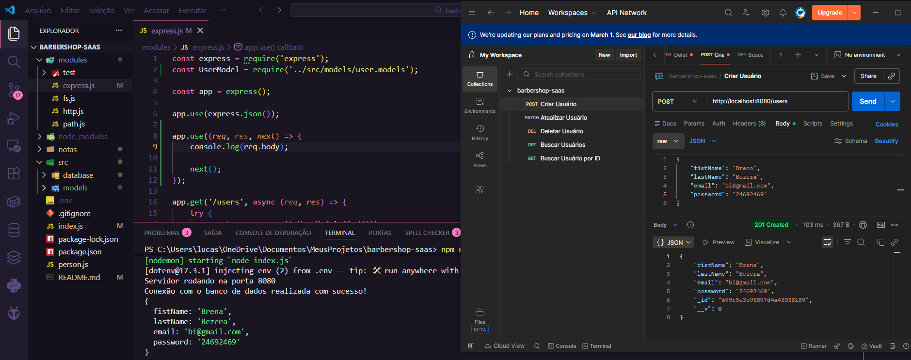
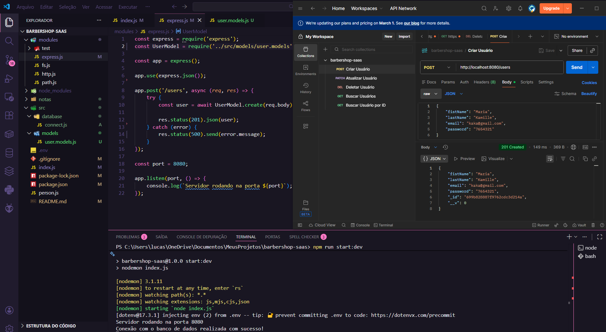
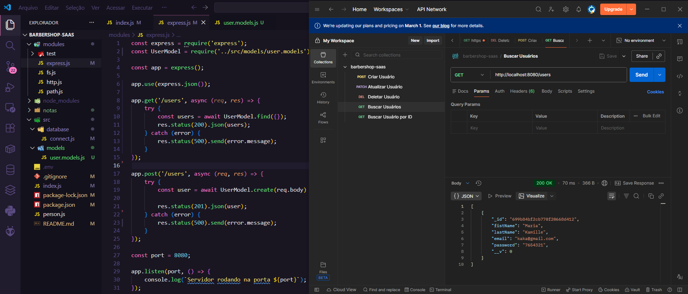
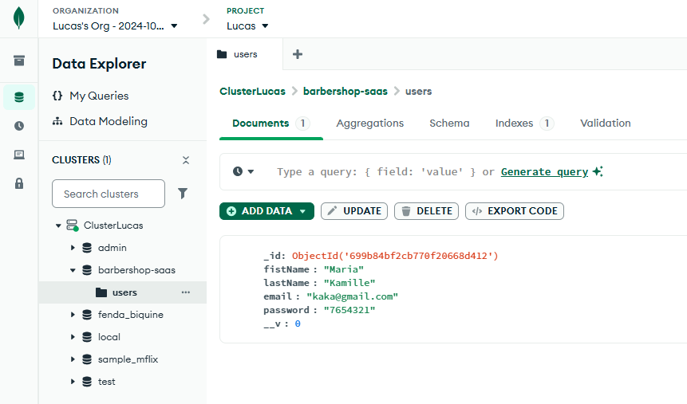

# Aula 04: 💾 Modelagem de Dados, Operações CRUD e Middlewares
Nesta aula, o SaaS da Barbearia avançou para a manipulação de dados reais. Aprendi a estruturar objetos no MongoDB, implementar as rotas fundamentais de uma API e utilizar Middlewares para interceptar e processar requisições.

## 🛠️ 1. Modelagem de Dados (Schemas)
Utilizei o Mongoose para definir a estrutura (Schema) dos usuários. Isso garante que os dados salvos no banco sigam uma regra rígida de validação.

- Campos definidos: `firstName`, `lastName`, `email` e `password`.
- Validações: Uso de `required: true` para campos obrigatórios e minlength para segurança de senhas.

## ⚡ 2. Middlewares: O Coração do Express
Middlawares são funções que são excutadas antes de qualquer ação do express.
Antes das rotas, configurei Middlewares para tratar as requisições:

1. **JSON Middleware:** `app.use(express.json())` é essencial para que o Express consiga ler o corpo das requisições (body) enviadas em formato JSON.
    
2. **Custom Middleware:** Implementei um middleware global para logar detalhes de cada acesso no terminal, como o método da requisição e o tipo de conteúdo.
    - O comando `next()` é obrigatório para que a requisição não fique "presa" e continue para a próxima função.
        

## 🏗️ 3. Implementação das Rotas CRUD
No arquivo `express.js`, implementei os métodos HTTP para gerenciar os usuários da barbearia.

### POST (Criar Usuário)
Permite o cadastro de novos clientes. Utilizei o método `UserModel.create(req.body)` para salvar os dados recebidos.

- Status de Sucesso: `201 Created`.

### GET (Buscar Usuários)
Implementei duas formas de busca:

1. Geral: Lista todos os usuários cadastrados via `UserModel.find({})`.

2. Por ID: Busca um usuário específico através do parâmetro de URL (`/users/:id`).

### PATCH (Atualizar Usuário)
Utilizado para editar informações (ex: trocar o e-mail do cliente) via findByIdAndUpdate.

> Dica técnica: Usei { new: true } para que o Mongoose retorne o usuário já com os dados atualizados na resposta.

### DELETE (Remover Usuário)
Implementei a remoção de registros através do método `findByIdAndDelete`.

## 📊 4. Verificação no MongoDB Atlas
Após realizar as requisições, validei que os dados foram persistidos corretamente no Cluster, dentro da collection `users` do banco `barbershop-saas`.

## 💡 Notas de Aprendizado
- **Tratamento de Erros:** Em todas as rotas, utilizei blocos `try/catch` retornando `status(500)` para garantir que o servidor não caia em caso de falha.

- **Status Codes:** Aprendi a importância de retornar os códigos corretos (200 para sucesso, 201 para criação e 500 para erro interno).

- **Ferramentas de Teste:** O uso de clientes HTTP (como o do VS Code) é essencial para validar a lógica do backend antes de construir o frontend.

- **Fluxo de Requisição:** O Middleware funciona como um pedágio; ele pode verificar se o usuário está logado ou apenas registrar logs antes da rota principal ser executada.

- **Async/Await:** Essencial para garantir que o código espere a resposta do banco de dados antes de enviar o `res.status(200)` para o cliente.

- **Diferença PATCH vs PUT:** Usei PATCH para atualizações parciais, o que é mais eficiente para o nosso SaaS quando queremos mudar apenas um campo como o e-mail.