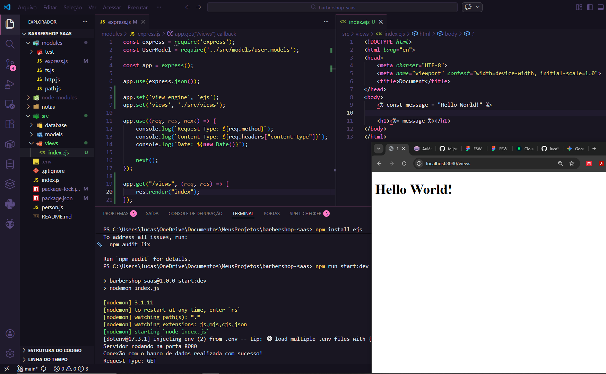
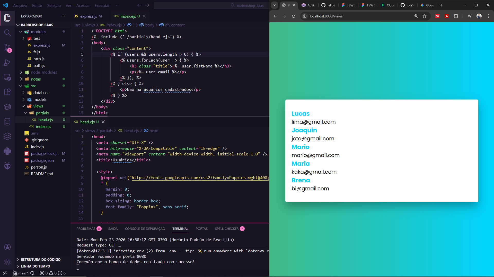

# Aula 05: Template Engine EJS e Renderização Dinâmica
Nesta aula, o SaaS da Barbearia deixou de ser apenas uma API de dados (JSON) para ter uma interface visual. Implementei o EJS (Embedded JavaScript) para gerar HTML dinâmico diretamente do servidor.

## 🛠️ 1. Configuração do EJS no Express
Para que o Express consiga renderizar páginas, instalei o motor de templates e configurei os caminhos no express.js:

1. Instalação: 
    ```bash 
    npm install ejs
    ```

2. **Configuração:** - `app.set('view engine', 'ejs')`: Define o EJS como motor de visualização.
    - `app.set('views', './src/views')`: Define a pasta onde os arquivos `.ejs` ficam guardados.



## 🏗️ 2. Renderização de Dados Dinâmicos
Criei uma rota `/views` que busca todos os usuários no MongoDB Atlas e os envia para o arquivo `index.ejs.`

- **Lógica no Backend:** Usei `UserModel.find({})` para capturar a lista e `res.render("index", { users })` para "injetar" essa lista no HTML.
- **Lógica no Frontend (EJS):** Utilizei as tags do EJS (`<% %>` e `<%= %>`) para criar estruturas de repetição e exibir dados como `user.firstName` e `user.email`.


## 🎨 3. Organização e Estilização (Partials)
Para manter o código limpo e profissional, apliquei o conceito de Partials (componentes reutilizáveis):

- **Head Partial:** Isolei as tags `<head>`, links de fontes (Google Fonts Poppins) e estilos CSS globais em um arquivo `partials/head.ejs`.
- **Inclusão:** Usei `<%- include('./partials/head.ejs') %>` para importar o cabeçalho em todas as páginas, garantindo um design consistente com fundo degradê e cards centralizados.



## 💡 Notas de Aprendizado
- **Template Engines:** O EJS permite que o servidor "monte" a página com dados reais antes de enviá-la ao navegador, o que é ótimo para SEO e carregamento inicial.
- **Diferenciação de Tags:**
    - `<% ... %>`: Para lógica (if, forEach, variáveis).
    - `<%= ... %>`: Para imprimir um valor que o usuário deve ver.
    - `<%- ... %>`: Para incluir outros arquivos ou HTML bruto.
- **Experiência do Usuário (UX):** Saímos de uma lista de texto puro para uma interface visual agradável, com tipografia moderna e cores que remetem a um produto SaaS premium.